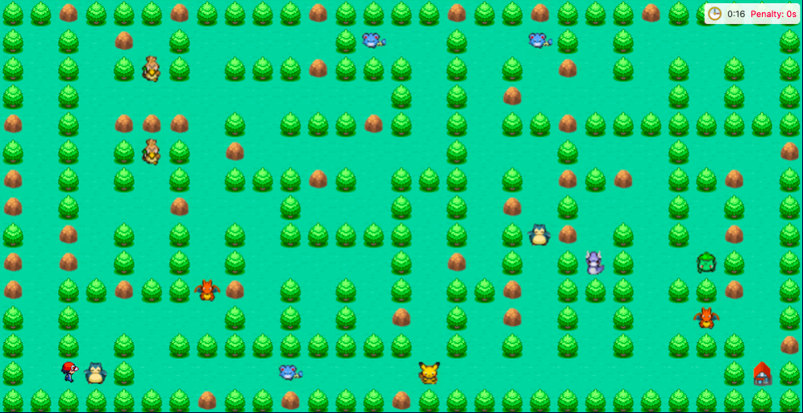

# Mazematics Client

- This is the frontend ReactJS web app of Mazematics
- Mazematics is a web app that has 3 platforms
	- Teaching Platform: For teachers to manage topics, levels, questions and learning materials
	- Learning Platform: For students to read through learning materials and play a maze game where they answer questions
	- Account Management System: For system admins to manage the user accounts
- The backend was developed separately
	- Documentation of the API endpoints can be found in backend_docs.pdf
-  This is a school project I did for CZ3003 Software Systems Analysis and Design
    -  My group mates are Chulpaibul Jiraporn, Elroy Liang Bo Jun, Ip Hei Man, Li Yan, Rajeswari Bose, Sin Chong Wen Bryan, Song Qiu Xuan and Su Voon Hou

## Documentation
- The documentation of the React components is available at https://rtkleong10.github.io/mazematics-client/
- Lab deliverables can be found in the `deliverables/` folder

## Directory Structure
### Subsystems
- Teaching Platform: `src/components/teaching`
- Learning Platform: `src/components/learning`
- Account Management System: `src/components/accounts`
- Gaming System: `src/components/game`

### Components
- Inside a subsystem, there are multiple components
- Each component should have:
    - `index.js`: Source file for React component
    - `index.test.js`: Unit testing file for React component

### Testing
- Unit tests can be found in the `index.test.js` files of each component's component folder
- Integration tests can be found in the `index.test.js` files in the `src/integrationTests` folder
    - There's one integration test for each user type (admin, student, teacher)

## Development
### Prerequisite
1. Install [Node.js](https://nodejs.org/en/)
2. `npm install` (only need to run once to download packages or when the `package.json` is updated)

### How to Run Development Server
1. `npm start`

### How to Run Docs Server
1. `npm run docs-dev`

### How to Run Tests (Unit & Integration Tests)
1. `npm test`

## Production
### Prerequisite
1. Install [Docker](https://www.docker.com/)

### How to Deploy
1. `docker-compose up -d --build` (it may take a while)

### How to Pause & Resume
- Pause: `docker-compose stop`
- Resume: `docker-compose start`

### How to View Logs
1. `docker logs mazematics-client -f`
